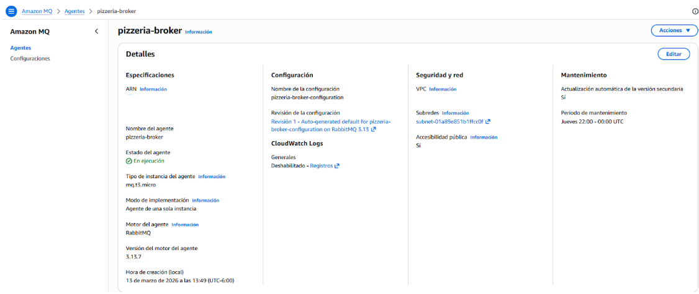
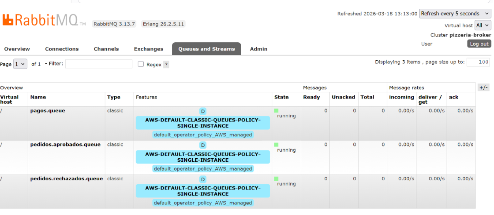
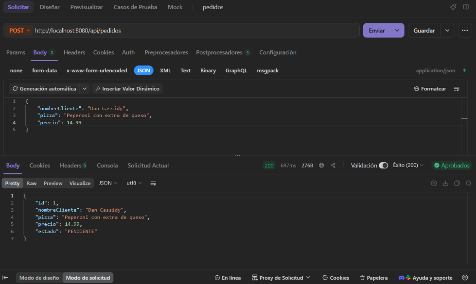
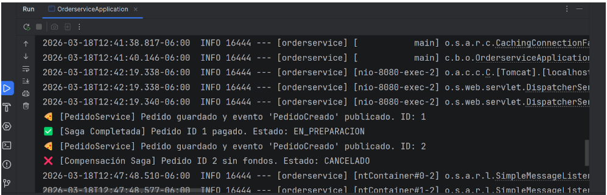

## 🚀 Tecnologías Utilizadas
* **Backend:** Java 21, Spring Boot 3.5.11, Spring Data JPA
* **Base de Datos:** H2 Database (In-Memory)
* **Mensajería:** Spring AMQP, RabbitMQ
* **Cloud Infrastructure:** Amazon MQ (AWS)

## 🧠 Arquitectura y Flujo (El Problema de la Pizzería)
Tenemos dos microservicios independientes con sus propias bases de datos:
1. `orderservice` (Puerto 8080): Recibe el pedido y lo guarda como `PENDIENTE`.
2. `paymentservice` (Puerto 8081): Procesa el cobro simulado.

**Flujo de Coreografía:**
1. El cliente pide una pizza a través de un endpoint REST.
2. `orderservice` emite el evento `PedidoCreado` a AWS.
3. `paymentservice` consume el mensaje, evalúa la regla de negocio (si cuesta > $20 se rechaza, si es <= $20 se aprueba).
4. `paymentservice` emite una respuesta (`PagoAprobado` o `PagoRechazado`).
5. `orderservice` escucha la respuesta y actualiza el pedido a `EN_PREPARACION` (éxito) o ejecuta la **compensación** pasándolo a `CANCELADO` (fallo).

## 📸 Evidencia de Ejecución

### 1. Infraestructura en AWS (Amazon MQ)



### 2. Colas creadas dinámicamente en RabbitMQ


### 3. Petición exitosa desde ApiDog


### 4. Logs de los Microservicios resolviendo la Saga


## ⚙️ Cómo ejecutar este proyecto localmente

1. Clona este repositorio y el repositorio paymentservice.
2. Crea un bróker de RabbitMQ en AWS (Amazon MQ) y asegúrate de habilitar el acceso público.
3. Actualiza el archivo `application.properties` en ambos proyectos con tus credenciales de AWS:
   `spring.rabbitmq.host=TU_ENDPOINT_AWS`
   `spring.rabbitmq.username=TU_USUARIO`
   `spring.rabbitmq.password=TU_PASSWORD`
4. Ejecuta `OrderServiceApplication` y `PaymentServiceApplication`.
5. Usa un cliente de peticiones HTTP para enviar un POST a `http://localhost:8080/api/pedidos` con el siguiente JSON:
   ```json
   {
       "nombreCliente": "Nombre Apellido",
       "pizza": "Tipo de pizza",
       "precio": 15.50
   }